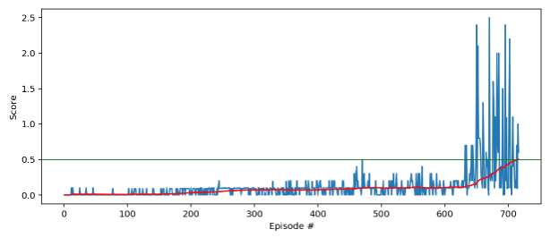

[//]: # (Image References)

[image1]: https://github.com/dewaniuk/deep-reinforcement-learning/blob/master/p3_collab-compet/tennis_slvd.gif "Trained Agent"

# Udacity Deep Reinforcement Learning
# Project 3: Collaboration and Competition

## Introduction

For this project, you will work with the [Tennis](https://github.com/Unity-Technologies/ml-agents/blob/master/docs/Learning-Environment-Examples.md#tennis) environment. This is a specific environment created by Udacity, please download this version if you wish to utilize code on your own.

#### This is my trained agent gamplay!

[Trained-agent](https://github.com/dewaniuk/deep-reinforcement-learning/blob/master/p3_collab-compet/tennis_slvd.gif)

![Trained Agent][image1]

In this environment, two agents control rackets to bounce a ball over a net. If an agent hits the ball over the net, it receives a reward of +0.1.  If an agent lets a ball hit the ground or hits the ball out of bounds, it receives a reward of -0.01.  Thus, the goal of each agent is to keep the ball in play.

The observation space consists of 8 variables corresponding to the position and velocity of the ball and racket. Each agent receives its own, local observation.  Two continuous actions are available, corresponding to movement toward (or away from) the net, and jumping. 

The task is episodic, and in order to solve the environment, your agents must get an average score of +0.5 (over 100 consecutive episodes, after taking the maximum over both agents). Specifically,

- After each episode, we add up the rewards that each agent received (without discounting), to get a score for each agent. This yields 2 (potentially different) scores. We then take the maximum of these 2 scores.
- This yields a single **score** for each episode.

The environment is considered solved, when the average (over 100 episodes) of those **scores** is at least +0.5.

## Agent

#### MADDPG agent (multi-agent deep deterministic policy gradient)
#### Agent architecture

The Udacity provided DDPG code in PyTorch was utilized and adapted for this tennis multi-agent environment.

The MADDPG neural network which is an actor-critic model, each with two hidden layers of 256 and 128 nodes, with ReLU activation functions on the hidden layers and tanh on the output layers. Each agent has its own nerual networks composed of a local and target actor and critic. The agents shared an experience memory utilized for training.

#### Hyperparameter settings

A batch size of 128 and a learning rate of 1e-3 on each DNN and were used along with replay buffer size of 1e6, gamma 0.99 and Tau (soft update setting) of 6e-2. Each agent took one step, then learned once, then repeated. Noise (Ornstein-Uhlenbeck process) was added as well. This environment with the MADDPG agent network is highly sensitive to Hyperparameter settings and attempted optimizations. After attempting mulple runs, with the hyperparameters chosen above, the agent(s) could achieving the desired goal of a 0.5 average reward. 

 

#### Results and Future Work

The model was able to achieve the 0.5 average reward goal (trailing 100 scores window) in 616 episodes.

I did attempt to utilize a prioritized experience buffer (PER) to improve on learning, but was unable to improve on the basic experience buffer. Perhaps other Hyperparameters need to be changed to work with a PER buffer.

What is very interesting is watching the trained agents. The style of gameplay of each agent changes with almost every training run. Sometimes one agent stays back and hits far, the other agent roams the board. Sometimes one agent appears to use more of a push style than a quick short hit of the other agents. My intuition leads me to think that this is due to a reward signal that is too simple which leads to the instability and difficulty to train without Hyperparameter optimization.

In the future I will look into modifying the rewards adding different rewards to emphasise "style" of play. I will also attempt to modify the code to work with the soccer multiagent environment.